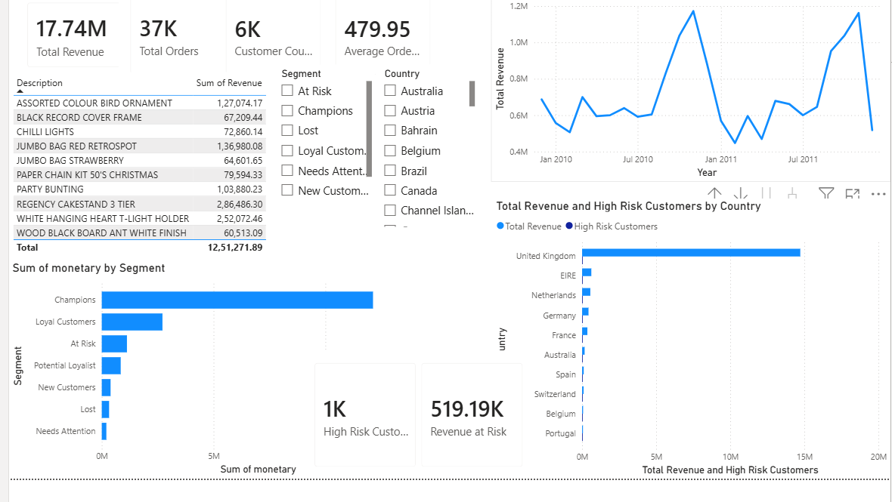

# Retail Customer Analytics

An end-to-end customer shopping behavior analytics project built during a Data Science & Data Analytics internship at Maincrafts Technology. The project covers data cleaning, customer segmentation, SQL-based business analysis, an interactive Power BI dashboard, and churn prediction modeling.



---

## Problem Statement

Retail businesses generate large volumes of transaction data but often struggle to translate it into actionable insight. This project analyzes historical purchase data to answer:

- Who are the most valuable customers, and how can they be segmented?
- Which products and regions drive the most revenue?
- Which customers are at risk of churning, and can we predict it?

---

## Dataset

**Source:** [UCI Online Retail II Dataset](https://archive.ics.uci.edu/dataset/502/online+retail+ii)

- ~1.07 million transaction records from a UK-based online retailer
- Time period: 2009–2011
- Fields: Invoice number, Stock code, Description, Quantity, Invoice date, Unit price, Customer ID, Country

**Note:** Raw data is not included in this repo due to file size. Download it directly from the UCI link above.

---

## Methodology

1. **Data Cleaning** — Removed cancelled/negative-quantity orders, handled missing Customer IDs, standardized date and price fields.
2. **RFM Segmentation** — Engineered Recency, Frequency, and Monetary features for unique customers; derived 7 customer segments (Champions, Loyal, At-Risk, Lost, etc.).
3. **SQL Analysis** — Queried the cleaned dataset (SQLite) to surface top products, revenue by region/segment, and repeat purchase patterns.
4. **Power BI Dashboard** — Built an interactive dashboard with DAX measures and 5 core visuals for sales trends, segmentation, and RFM distribution.
5. **Churn Prediction** — Trained and compared Logistic Regression and Random Forest models to predict customer churn, with ROC curve analysis and full performance evaluation.

---

## Tech Stack

- **Python** — pandas, numpy, scikit-learn, matplotlib/seaborn
- **SQL** — SQLite
- **Power BI** — DAX, interactive dashboards
- **Jupyter Notebook**

---

## Key Results

- Cleaned and merged 1,067,371 transaction records (2009–2011) into a single analysis-ready dataset
- Segmented unique customers into 7 actionable RFM-based groups
- Identified top revenue-driving products and regions via SQL
- Trained and compared two churn prediction models:

| Model | Accuracy | Precision | Recall | F1 Score |
|---|---|---|---|---|
| Logistic Regression | 0.7394 | 0.7215 | 0.7442 | 0.7327 |
| Random Forest | 0.7223 | 0.6907 | 0.7631 | 0.7251 |

- Exported per-customer churn probabilities and risk bands (Low / Medium / High) for 4,966 customers, ready to feed into the Power BI dashboard

---

## How to Run

```bash
git clone https://github.com/nikitasinghchauhan05/retail-customer-analytics.git
cd retail-customer-analytics
pip install -r requirements.txt
```

Download the UCI dataset from the link above, then open and run the analysis notebook end to end.

---

## Author

**Nikita Singh Chauhan**
B.Tech CSE, Jaypee University of Engineering and Technology (JUET)
[GitHub](https://github.com/nikitasinghchauhan05)
